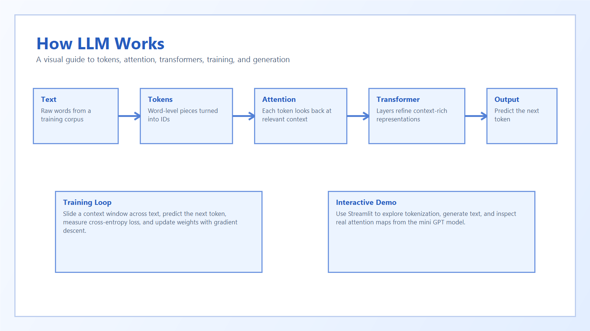
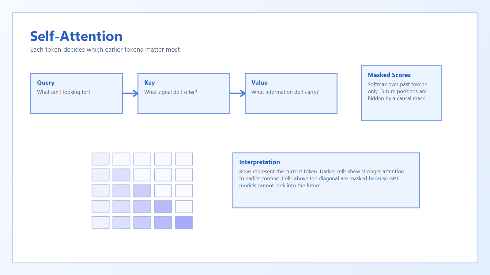

# How LLM Works

A visual, interactive, and beginner-friendly repository for understanding how GPT-style large language models work from first principles.



## Overview

`how-llm-works` is an educational open source project that combines:

- a minimal GPT-style model implemented in PyTorch
- visual diagrams for core LLM concepts
- guided documentation from tokenization to inference
- a Streamlit app for interactive exploration
- a small end-to-end training and generation pipeline

The project is intentionally compact, but the architecture is faithful to the main ideas behind real transformer language models.

## Features

- Word-level tokenizer with vocabulary building and encode/decode support
- Token and positional embeddings
- Causal multi-head self-attention
- Transformer blocks with residual connections and layer normalization
- Next-token training with cross-entropy loss
- Greedy autoregressive text generation
- Streamlit UI with:
  - text generation
  - tokenization explorer
  - attention heatmap visualization
- Banking-themed examples across docs, notebooks, and demo prompts

## Demo Visuals




## Repository Structure

```text
how-llm-works/
|- app/         # Streamlit interface
|- src/         # Core tokenizer, model, training, and generation logic
|- docs/        # Beginner-friendly tutorials and explanations
|- visuals/     # Diagram assets used throughout the project
|- data/        # Sample banking-themed training corpus
|- notebooks/   # Exploratory notebooks
|- tests/       # Unit tests
`- assets/      # Launch and publishing assets
```

## Architecture

This repository implements a minimal GPT-style language model:

1. Text is split into word-level tokens.
2. Tokens are converted to integer IDs.
3. Token embeddings and positional embeddings create dense vector representations.
4. Causal self-attention lets each token attend only to earlier tokens.
5. Transformer blocks refine the hidden state.
6. A final linear projection predicts the next token.

## Learning Path

Read the docs in order:

1. [Introduction](docs/01_intro.md)
2. [Tokens And Embeddings](docs/02_tokens_embeddings.md)
3. [Attention](docs/03_attention.md)
4. [Transformer Blocks](docs/04_transformer.md)
5. [Training](docs/05_training.md)
6. [Inference](docs/06_inference.md)
7. [Limitations](docs/07_limitations.md)
8. [Real-World LLMs](docs/08_real_world_llms.md)

## Installation

### Prerequisites

- Python 3.10 or newer recommended
- `pip`

### Setup

```bash
python -m venv .venv
.venv\Scripts\activate
pip install -r requirements.txt
```

## Usage

### Train the model

```bash
python src/train.py
```

This trains the mini GPT model on `data/sample.txt` and saves a checkpoint as `model.pth`.

### Generate text

```bash
python src/generate.py --prompt "banks manage credit"
```

### Run the Streamlit app

```bash
streamlit run app/ui.py
```

The app includes:

- Text Generation
- Tokenization Explorer
- Attention Visualization

If `model.pth` is missing, the app automatically trains a fresh model on startup.

## Streamlit Community Cloud Deployment

This repository is organized to work with Streamlit Community Cloud:

- app entrypoint: `app/ui.py`
- dependency file: `requirements.txt`
- config file: `.streamlit/config.toml`

Deployment steps:

1. Push the repository to GitHub.
2. Sign in to Streamlit Community Cloud.
3. Create a new app from your GitHub repository.
4. Choose the target branch.
5. Set the main file path to `app/ui.py`.
6. Deploy.

## Testing

Run the unit tests with:

```bash
python -m unittest discover -s tests -v
```

Current test coverage includes:

- tokenizer encoding and decoding
- attention output shapes
- model forward-pass shapes

## Documentation And Notebooks

In addition to the docs, the repository includes notebooks for:

- tokenization
- embeddings
- attention
- transformer blocks
- training
- generation

These are useful for experimentation and classroom-style walkthroughs.

## Example Use Cases

This project is a good fit for:

- students learning transformers for the first time
- educators teaching LLM fundamentals
- developers who want a compact reference implementation
- portfolio projects demonstrating AI education tooling

## Limitations

This is an educational mini-model, not a production LLM.

Important constraints:

- very small dataset
- word-level tokenizer only
- tiny model size
- greedy decoding only
- limited generalization beyond the sample corpus

See [docs/07_limitations.md](docs/07_limitations.md) for more detail.

## Contributing

Contributions are welcome.

Helpful contribution areas include:

- improving explanations and examples
- polishing diagrams and visuals
- expanding tests
- improving the Streamlit learning experience
- adding optional experiments while keeping the beginner-friendly core

If you plan a larger change, open an issue or discussion first so the direction stays aligned with the educational goals of the project.

## License

This project is released under the [MIT License](LICENSE).

## Acknowledgments

This repository was designed as a visual-first learning project to make LLM internals more approachable without hiding the real architecture.
