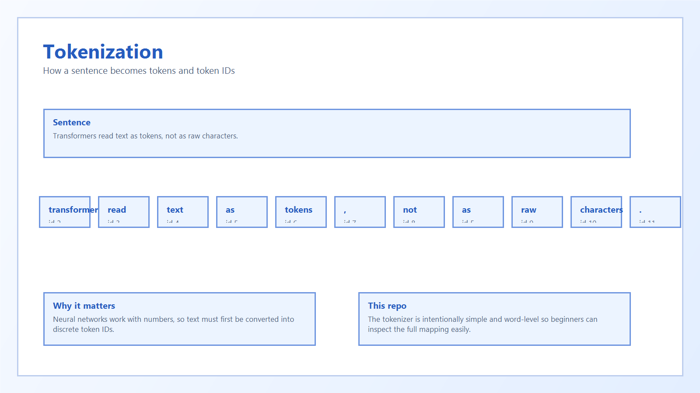
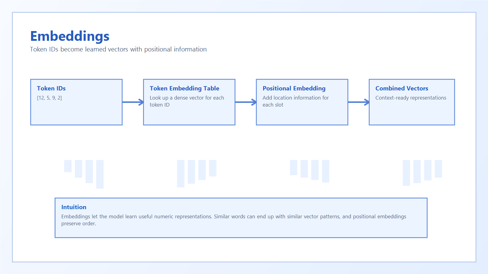

# 2. Tokens And Embeddings

Computers do not read raw sentences the way humans do. They work with numbers.

## Tokens

A tokenizer breaks text into smaller pieces called tokens.

In this repository, we use a simple word-level tokenizer.

Example sentence:

`Transformers are powerful models.`

Tokens:

`["transformers", "are", "powerful", "models", "."]`

Each token is mapped to an integer ID.

## Embeddings

A token ID by itself is just a label. An embedding turns that label into a learned vector.

Why do this?

- similar words can end up with similar vectors
- the model can do math on vectors
- transformer layers work on dense numeric representations

## Positional Information

Words also need order. `dog bites man` is different from `man bites dog`.

The model adds positional embeddings so each token knows where it appears in the sequence.

## Example

Token IDs:

`[12, 5, 9, 2]`

Embedded vectors:

`[[...], [...], [...], [...]]`

These vectors are what attention sees next.
