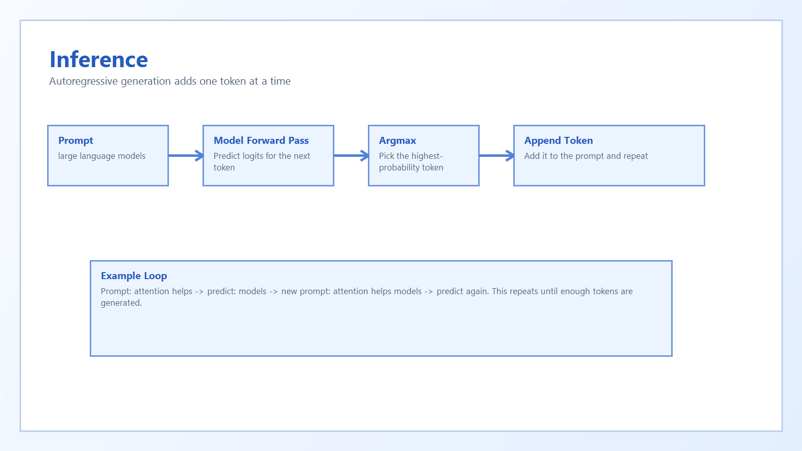

# 6. Inference

Inference means using the trained model to generate new text.

## Autoregressive Generation

The model starts with a prompt, predicts the next token, appends it, and repeats.

That process looks like:

1. Encode the prompt
2. Predict the next token
3. Append the prediction
4. Feed the updated sequence back in
5. Repeat until enough tokens are generated

## Greedy Decoding

This project uses greedy decoding, which means:

- look at the predicted probabilities
- pick the single most likely token with `argmax`

This is simple and deterministic.

## Example

Prompt:

`a bank manages`

Generated token 1:

`credit`

Generated token 2:

`risk`

The final output becomes:

`a bank manages credit risk`
